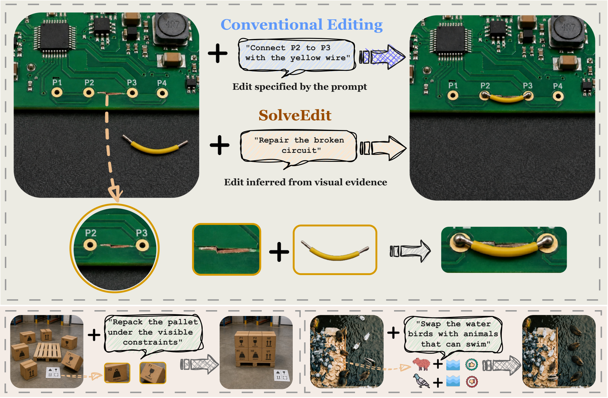

<h2 align="center">SolveEdit: Benchmarking Visual Problem Solving in Generative Models</h2>

<div align="center">

**Wenjie Shu<sup>1,†</sup>, Yexin Liu<sup>2,†</sup>, Harold Haodong Chen<sup>2</sup>, Xuerui Qiu<sup>3</sup>, Zehan Wang<sup>4</sup>,<br>
Yidi Zhang<sup>1</sup>, Yizhan Chen<sup>1</sup>, Zunwei Wang<sup>1</sup>, Minghao Liu<sup>5</sup>,<br>
Qi Chen<sup>1,*</sup>, Harry Yang<sup>2,*</sup>, Xiaogang Xu<sup>4</sup>**

<sup>†</sup>Equal contribution. <sup>*</sup>Corresponding authors.

<sup>1</sup>ZODA · <sup>2</sup>HKUST · <sup>3</sup>UCAS · <sup>4</sup>ZJU · <sup>5</sup>UTokyo

[](https://wenjieshu.github.io/SolveEdit-project-page/static/pdfs/solveedit.pdf)
[](https://wenjieshu.github.io/SolveEdit-project-page/)
[](https://wenjieshu.github.io/SolveEdit-project-page/#leaderboard)

</div>

## Table of Contents

- [Release Status](#release-status)
- [Overview](#overview)
- [Evaluation Results](#evaluation-results)
- [Installation](#installation)
- [SolveEdit-Plan](#solveedit-plan)
- [Evaluation](#evaluation)
- [Repository Structure](#repository-structure)
- [Release Scope](#release-scope)

## Release Status

- [x] Project page and paper PDF.
- [x] SolveEdit-Plan: Inspect, crop extraction, and Resolve.
- [x] VLM evaluation runner and deterministic scoring core.
- [ ] Benchmark images and atomic contracts.
- [ ] Specialized checker integration and disagreement adjudication.

**This is a code release.** Benchmark images and contracts will be distributed separately. The current evaluator uses VLM verdicts and does not include the complete specialized-checker protocol used in the paper.

## Overview

SolveEdit studies visual problem solving through transformation of an existing scene. Given an image and a goal, a model must determine a valid transition from the request and visible evidence, execute it, and preserve unrelated content. The benchmark contains **2,728 cases across 10 domains and 54 subdomains**, organized into instruction-specified (IS), state-dependent (SD), and rule-dependent (RD) regimes.

<p align="center">
  
</p>

**SolveEdit-Plan** resolves the transition before generation through two stages:

1. **Inspect** identifies unresolved edit variables and requests useful crops.
2. **Resolve** compares candidate transitions against visible evidence and compiles an editing instruction.

The planner requires no training or changes to the editor. This repository produces the compiled instruction; the final generation call is performed by an external image or video generator.

## Evaluation Results

The strongest directly evaluated model achieves **57.0% SolveScore**. Under matched single-generation evaluation, SolveEdit-Plan improves GPT-Image-2 from **57.0% to 71.6%**.

| Direct model | Required R ↑ | Damage D ↓ | SolveScore ↑ |
| :--- | ---: | ---: | ---: |
| GPT-Image-2 | 67.6 | 23.9 | **57.0** |
| Seedream 5.0 Pro | 64.3 | 17.6 | 56.6 |
| Gemini 3.1 Flash Image | 66.0 | 23.1 | 55.5 |

Scores are percentages. These are paper results from the full evaluation protocol; this code release alone cannot reproduce the leaderboard. See the [complete 11-model leaderboard](https://wenjieshu.github.io/SolveEdit-project-page/#leaderboard) for details.

## Installation

### 1. Clone and Install

Python 3.10 or newer is required.

```bash
git clone https://github.com/WenjieShu/SolveEdit.git
cd SolveEdit
python3 -m venv .venv
source .venv/bin/activate
python -m pip install -e .
```

### 2. Configure the API

Both runners use an OpenAI-compatible `chat/completions` endpoint with image inputs. Set `SOLVEEDIT_API_KEY` (or `OPENAI_API_KEY`) in your environment and choose a vision-capable model supported by your provider.

```bash
export SOLVEEDIT_API_KEY="YOUR_API_KEY"
export SOLVEEDIT_API_BASE_URL="https://api.openai.com/v1"
```

The default base URL is `https://api.openai.com/v1`. Use `--base-url` for another compatible provider.

## SolveEdit-Plan

### Input Manifest

Prepare a JSONL manifest with one record per line. `input_image` can be relative to the manifest:

```json
{"uid":"example-1","case_id":"example-1","input_image":"images/example.png","instruction":"Move the item to the correct place."}
```

### Run

```bash
python scripts/run_plan.py \
  --manifest my_cases.jsonl \
  --output-dir outputs/plan \
  --model YOUR_VISION_MODEL
```

### Outputs

Each case writes `inspection.json`, image crops, `plan.json`, and API usage metadata. The `compiled_instruction` field in `plan.json` is the instruction to pass to your editor. Planner input validation rejects evaluation-only fields, including contracts and reference images.

Add `--resume` to skip cases with an existing plan. Run `python scripts/run_plan.py --help` for all options.

## Evaluation

### Input Manifest

The evaluator reads user-supplied `solveedit.atomic_contract.v3` contracts and input/output image pairs. An evaluation manifest is a JSON object with a `records` array. Paths can be relative to the manifest:

```json
{
  "records": [
    {
      "uid": "example-1",
      "case_id": "example-1",
      "contract_path": "contracts/example-1.json",
      "input_image": "images/example.png",
      "output_image": "outputs/example.png",
      "model": "my-editor"
    }
  ]
}
```

### Run

```bash
python scripts/run_eval.py \
  --eval-manifest my_eval.json \
  --output-dir outputs/eval \
  --judge-model YOUR_VISION_MODEL
```

Use `--dry-run` to inspect prompts and file handling without an API call. The evaluator asks for a quality gate and pass/partial/fail/abstain judgments for each atom. It applies hierarchical weights within required and protected groups and computes `max(0, R - 0.5 D)` after the quality gate. Missing output images receive zero and remain in the run mean. The result JSON retains atomic verdicts, reasons, and visible evidence for inspection.

## Repository Structure

```text
SolveEdit/
├── assets/                  # Paper overview figure
├── scripts/
│   ├── run_plan.py          # Planning entry point
│   └── run_eval.py          # Evaluation entry point
├── src/solveedit/
│   ├── planner.py           # Inspect, crops, and Resolve
│   ├── planner_schema.py    # Planner record validation
│   └── evaluation.py        # Contract weights and scoring
├── tests/
└── pyproject.toml
```

Run the local checks:

```bash
python -m unittest discover -s tests
```

## Release Scope

This repository includes planning and VLM evaluation code, plus a paper overview figure. It does not include benchmark contracts, case images, generated outputs, or private production scripts. The published evaluator omits preassigned SAM/YOLO checker calls and disagreement adjudication; its scores should not be presented as the paper's full evaluation protocol. The planner output is an instruction for an external generator, not a generated image.
